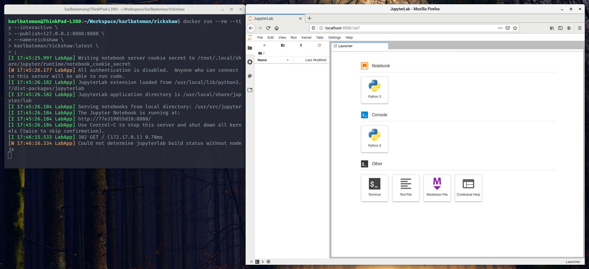

# Rickshaw

> An unofficial Docker version of Jupyter.

## Introduction

[Jupyter] is an online data science environment. Rickshaw is a Docker version
of Jupyter which simplifies setup and deployment.

[jupyter]: https://jupyter.org



## Getting Started

Before you proceed with usage examples, please ensure you have [Docker]
installed on your system.

[docker]: https://docker.com

## Build

After cloning this project onto your machine. Run the following command in your
terminal, from within this projects directory.

```bash
docker build --tag=krb-oss/rickshaw .
```

### Usage

Run either of the following commands to launch a local instance, depending on
your needs.

```bash
docker run --rm --tty --interactive \
  --publish=127.0.0.1:8888:8888 \
  --name=rickshaw \
  krb-oss/rickshaw \
  ;
```

For mounting a persisted volume, please use the following command.

```bash
docker run --rm --tty --interactive \
  --publish=127.0.0.1:8888:8888 \
  --name=rickshaw \
  --volume=$HOME/.data/notebooks:/usr/src/app \
  krb-oss/rickshaw \
  ;
```

Visit <http://localhost:8888> in your web browser.

## Kernels

The following kernels have been configured to work with this Jupyter configuration.

| Kernel   | Version |
| ---      | ---     |
| [python] | 3.8     |

[python]: https://www.python.org

## License

[BSD](LICENSE) © [@KRB OSS](https://github.com/krb-oss)
